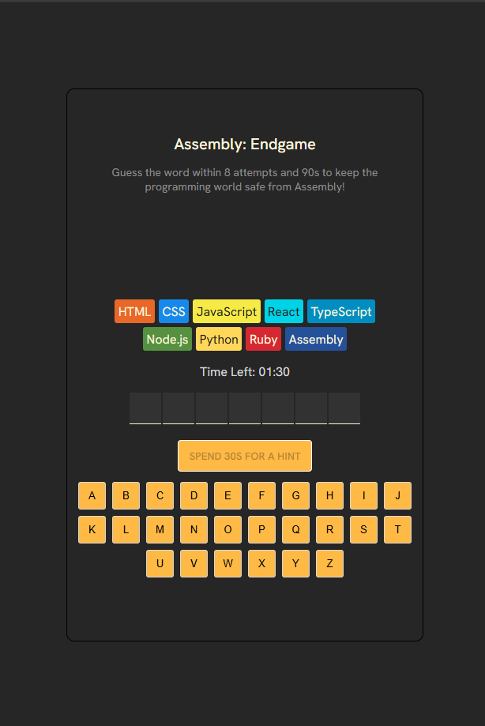
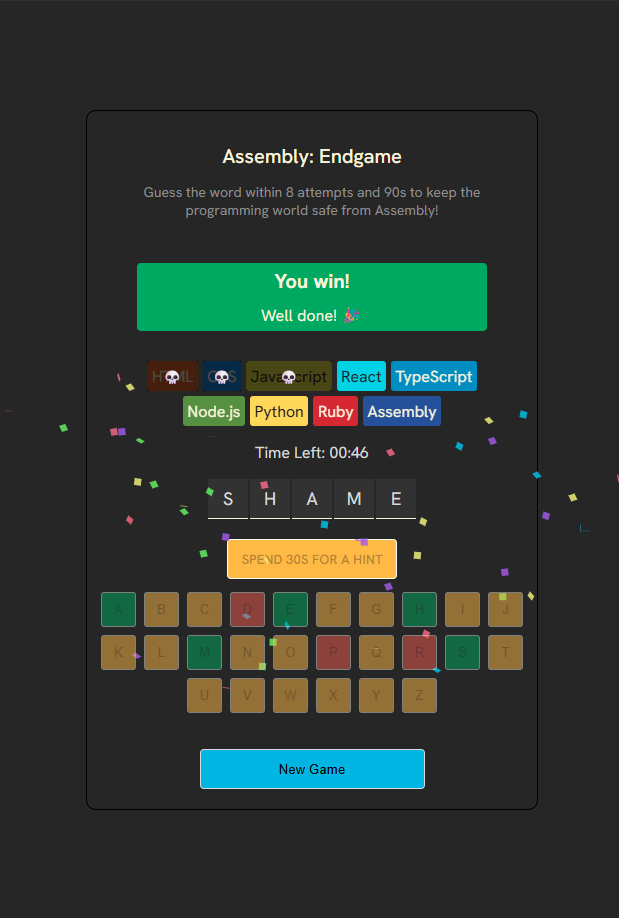
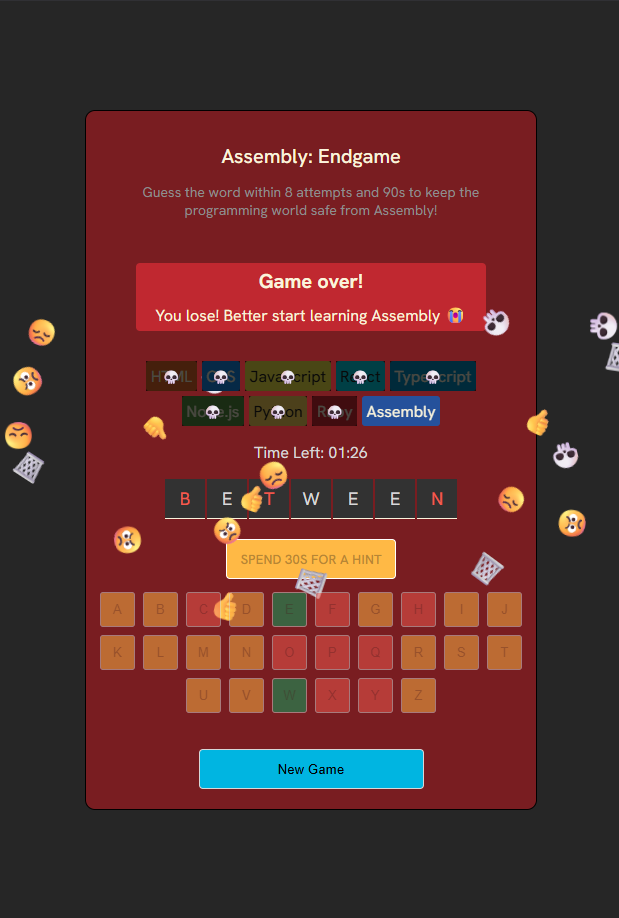

# Assemble: Endgame
Recreating the Hangman game with a retheming revolve around programming languages.  The game is built using ***React*** Framework.

## Get started
Visit the implementation here: https://assembly-endgame-ho1x.onrender.com/

    
    
    

## Implementation
* The players are challenged to guess a randomly generated word within ***90 seconds*** and ***8 wrong guesses***.
* The players get a chance to trade 30seconds for a hint.
* The background of the game will slowly transition into red as the player moves closer towards triggering loss conditions.
* Upon the game conclusion, confetti will be spread across the screens.

## Key takeaways
Please refer to this repository: https://github.com/wengti/react-note